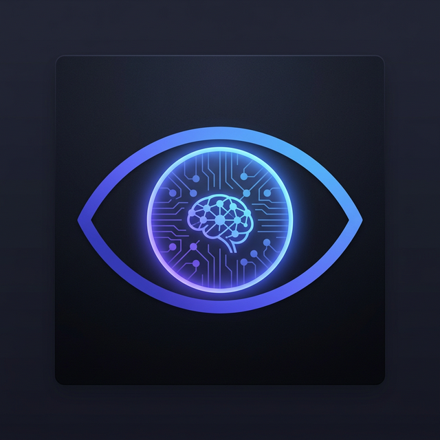

<p align="center">
  
</p>

<h1 align="center">VISION AI</h1>

<p align="center">
  <strong>Your PC's Brain — An All-Rounder AI Agent + Chat Assistant Built in Native C++</strong>
</p>

<p align="center">
  <a href="#-download--install"></a>
  <a href="#-build-from-source"></a>
  <a href="#-architecture--tech-stack"></a>
  <a href="#-core-features"></a>
  <a href="#%EF%B8%8F-cloud-inference-optional--groq-api"></a>
  <a href="LICENSE"></a>
</p>

<p align="center">
  <em>Chat naturally. Execute OS tasks. Control your entire desktop — with voice or text. 100% offline-capable.</em>
</p>

---

## 🎬 What is VISION AI?

**VISION AI** is a native **Windows desktop AI agent** that combines the intelligence of a chatbot with the power of a system automation tool. Think of it as **ChatGPT + Windows Copilot** — but running **completely on your machine**, with **native C++ speed**, and **zero data leaving your PC**.

```
You: "Hey, what is machine learning?"
VISION AI: "Machine learning is a subset of AI where computers learn patterns
            from data without being explicitly programmed..."

You: "Open Chrome and search for latest AI news"
VISION AI: ✅ Opened Chrome → Typed "latest AI news" → Pressed Enter

You: "Take a screenshot"
VISION AI: 📸 Screenshot saved to Desktop/screenshot_2026-03-07.png

You: "Set volume to 50%"  
VISION AI: 🔊 Volume set to 50%
```

### The Difference

| | Cloud Copilots | **VISION AI** |
|---|---|---|
| **Privacy** | Your data on someone's server | 🔒 Everything stays on your machine |
| **Latency** | Network round-trip per request | ⚡ Instant — native CPU/GPU inference |
| **Chat** | ✅ Can chat | ✅ Can chat **+ execute OS tasks** |
| **Availability** | Requires internet | 🌐 Works on airplane mode |
| **Cost** | Monthly subscription | 💰 Free & open-source, forever |
| **Agent** | Limited to browser | 🖥️ Controls your **entire desktop** |

---

## ✨ Core Features

### 🧠 Dual-Mode AI: Chat + Agent

VISION AI uses a **smart intent detection** system. Every message goes through the AI, which decides:

- **Is this a conversation?** → Responds naturally (like ChatGPT)
- **Is this a command?** → Executes it on your OS (like a real assistant)

The AI understands **English, Hindi, and Hinglish** — it automatically matches your language.

```
You: "Kya haal hai?"
VISION AI: "Mein theek hoon! Batao, kya madad chahiye? 😊"

You: "Notepad kholo"
VISION AI: ✅ Opened Notepad
```

---

### 🔀 Dual-Inference Engine

Two AI backends, seamlessly switchable at runtime:

| Feature | 🏠 Local (Default) | ☁️ Cloud (Groq) |
|---------|:-:|:-:|
| **Engine** | llama.cpp (GGUF) | Groq REST API (libcurl) |
| **Models** | Llama 1B, Phi-3, Qwen, etc. | Llama-3.3-70B, Mixtral |
| **Speed** | Hardware-dependent | ~500 tokens/sec (Groq LPU) |
| **Privacy** | 100% offline | API calls to Groq |
| **Internet** | Not required | Required |
| **Cost** | Free | Free tier available |

**Context Persistence:** When you switch backends mid-conversation, your chat history is preserved and auto-translated for the new model family.

---

### 🎤 Voice Control

Press **`Ctrl+Alt+Space`** and speak. VISION AI converts speech to text using [whisper.cpp](https://github.com/ggerganov/whisper.cpp) — all on-device, no internet needed.

- **True Live Streaming (Gboard-style)** — Real-time partial transcriptions update instantly as you speak.
- **Lock-Free Audio Pipeline** — Powered by a high-performance Single-Producer/Single-Consumer (SPSC) ring buffer, ensuring zero audio drops even under heavy LLM/UI load.
- **Auto Voice Activity Detection (VAD)** — Automatically detects speech onset and ends using RMS energy heuristics.

---

### 🖥️ OS-Level Automation

VISION AI doesn't just "see" your screen — it **understands and controls it**:

| Capability | Technology | What It Does |
|---|---|---|
| **UI Automation** | Microsoft UIA (COM) | Reads accessibility tree — clicks buttons, reads text, fills forms by semantic name |
| **OCR Fallback** | Tesseract 5 + OpenCV 4 | Visually reads text from legacy apps, games, or apps without accessibility support |
| **Screen Observer** | DXGI Desktop Duplication | Captures screen changes using perceptual hashing (pHash) — detects what changed |
| **Smart Input** | Win32 SendInput + Caret Tracking | Types text with zero dropped characters — monitors the target thread's readiness |
| **Window Control** | Win32 API | Open, close, minimize, maximize, focus, list, and arrange windows |
| **System Control** | Win32 + WMI | Volume, brightness, app launching, power management |

---

### 🧩 Smart Command Pipeline

Every user message flows through an optimized 4-stage pipeline:

```
User Input
    │
    ├─→ Stage 1: Fast Complex Handler (~0ms)
    │   "open edge and search Microsoft rewards" → instant compound execution
    │
    ├─→ Stage 2: Chained Commands (~0ms per step)
    │   "open notepad then take screenshot" → sequential execution
    │
    ├─→ Stage 3: Template Matcher (~0ms)
    │   "open notepad" / "screenshot" / "set volume 50" → instant pattern match
    │
    └─→ Stage 4: AI Agent (ReAct Loop)
        "What is AI?" / "Help me organize my desktop" → AI decides & acts
        │
        ├─→ Safety Gate: "delete system32" → ⛔ Requires confirmation
        └─→ AI Response: chat reply OR OS action (1-step fast-exit for chat)
```

Simple known commands execute **instantly** (~0ms). Complex or conversational inputs go to the AI agent. Chat replies complete in **1 step** — no unnecessary ReAct loop iterations.

> **💡 Stability Note:** VISION AI leverages strict **ChatML context bounding** (`<|im_start|>` / `<|im_end|>`) compatible with Llama-3 and Qwen. This definitively prevents the "infinite context generation" memory-leak crashes common in local LLM wrappers.

---

### 🗄️ Semantic Vector Memory

VISION AI remembers your past tasks and learns your patterns — without any external database:

- **Pure C++ Cosine Similarity** — Computes vector similarity from LLM embeddings
- **Encrypted Persistence** — Memory files encrypted with **Windows DPAPI**
- **Behavioral Learning** — Tracks patterns for faster, more contextual actions

---

### 🛡️ Military-Grade Privacy

| Protection | How |
|---|---|
| **Encryption at Rest** | DPAPI (Windows Data Protection API) — tied to your Windows credentials |
| **API Key Security** | DPAPI-encrypted, auto-restored on startup, secure memory wipe on close |
| **File Whitelisting** | `SafetyGuard` blocks AI from accessing files outside explicit whitelist |
| **Dangerous Command Block** | Confidence Scorer blocks `format`, `delete`, `kill`, `system32` etc. |
| **Zero Telemetry** | No analytics, no crash reports, no network calls. `netstat` confirms: silent |

---

### ⚙️ Hardware-Aware Optimization

A built-in **`DeviceProfiler`** fingerprints your system at startup:

| System Tier | RAM | GPU | Context Window | Threads |
|---|---|---|---|---|
| 🟡 Low-End | 8 GB | Integrated | 2,048 tokens | Auto (conservative) |
| 🟢 Mid-Range | 16 GB | GTX 1650+ | 4,096 tokens | Auto (balanced) |
| 🔵 High-End | 32 GB+ | RTX 4050+ | 8,192 tokens | Auto (max) |

- **GPU Auto-Detection** — **CUDA** → **Vulkan** → **CPU** fallback
- **Idle Auto-Unload** — LLM auto-unloads after 5 minutes of inactivity to free RAM/VRAM
- **Dynamic Context Sizing** — Scales 2K–8K tokens based on available memory

---

## 📥 Download & Install

### Pre-Built Release (Recommended)

1. Go to the [**Releases**](../../releases) tab
2. Download `VISION_AI_vX.X.X_Setup.exe` or the portable `.zip`
3. Launch `VISION_AI.exe`
4. The **Model Downloader Wizard** will auto-detect your hardware and download the right model

### First-Run Experience

On first launch, VISION AI guides you through:

1. **🖥️ GPU Setup Wizard** — Detects your GPU and selects the optimal backend (CUDA/Vulkan/CPU)
2. **📦 Model Downloader** — Downloads a hardware-appropriate LLM model automatically
3. **⚙️ Settings** — Set your Groq API key (optional), choose engine mode (Local/Cloud/Hybrid)

> **💡 Tip:** You can also manually place any `.gguf` model into the `models/` folder.

---

## ☁️ Cloud Inference (Optional — Groq API)

### Setup (2 Minutes)

1. Get a **free** API key from [console.groq.com](https://console.groq.com)
2. Open VISION AI → Click ⚙️ Settings → Paste your API key
3. Select **Cloud** or **Hybrid** engine mode
4. Done! Your key is **DPAPI-encrypted** and auto-restored on every startup

### Or via Environment Variable

```powershell
# PowerShell (permanent)
[System.Environment]::SetEnvironmentVariable("GROQ_API_KEY", "gsk_YOUR_KEY_HERE", "User")
```

The **Instruction Translator** automatically adapts prompts when switching between model families (Qwen ↔ Llama-3 ↔ Phi-3) for optimal instruction-following.

---

## 🛠️ Build from Source

### Prerequisites

| Dependency | Version | Notes |
|---|---|---|
| **CMake** | ≥ 3.20 | Build system |
| **MSVC** | VS 2022+ | C++20 compiler |
| **Qt6** | 6.x | `Widgets`, `Core` modules |
| **OpenCV** | 4.x | *Optional* — OCR & template matching |
| **Tesseract** | 5.x | *Optional* — OCR fallback |
| **PortAudio** | 19.x | *Optional* — microphone capture |
| **libcurl** | 8.x | *Optional* — Groq Cloud API |
| **CUDA** | 12.x | *Optional* — NVIDIA GPU |
| **Vulkan SDK** | 1.3+ | *Optional* — AMD/Intel GPU |

### Clone & Build

```bash
# Clone with submodules (llama.cpp, whisper.cpp, spdlog)
git clone --recursive https://github.com/HR-894/VISION_AI_C-.git
cd VISION_AI_C-

# Configure (GPU backend is auto-detected)
cmake -B build -G "Visual Studio 17 2022" -A x64

# Build
cmake --build build --config Release --parallel

# Run
./build/bin/Release/VISION_AI.exe
```

### CMake Options

| Option | Default | Description |
|---|---|---|
| `VISION_ENABLE_LLM` | `ON` | llama.cpp local LLM inference |
| `VISION_ENABLE_CLOUD` | `ON` | Groq Cloud inference (requires libcurl) |
| `VISION_ENABLE_WHISPER` | `ON` | whisper.cpp speech-to-text |
| `VISION_ENABLE_OCR` | `ON` | Tesseract OCR |
| `VISION_ENABLE_AUDIO` | `ON` | PortAudio microphone capture |

> GPU backend auto-detected: **CUDA** → **Vulkan** → **CPU**. No manual flags needed.

---

## 🏗️ Architecture

```
VISION AI v3.1 (V2 Architecture)
├── Language          C++20 (MSVC /std:c++20)
├── UI Framework      Qt 6 (Widgets, Core, Dark Theme)
├── LLM Engine        llama.cpp (GGUF, CUDA/Vulkan/CPU)
├── Cloud Engine      Groq REST API (libcurl)
├── Speech-to-Text    whisper.cpp (ggml models)
├── Audio Pipeline    Lock-Free SPSC Ring Buffer + VoiceManager
├── OCR               Tesseract 5 + OpenCV 4
├── Screen Capture    DXGI Desktop Duplication API
├── Audio Capture     PortAudio 19
├── UI Automation     Microsoft UIA (COM)
├── Input Simulation  Win32 SendInput + GUI Thread Caret
├── Encryption        Windows DPAPI (CryptProtectData)
├── Vector Memory     Pure C++ Cosine Similarity
├── JSON              nlohmann/json (header-only)
├── Logging           spdlog (rotating file + console)
└── Build System      CMake 3.20+
```

### Module Map (31 Source Files)

<details>
<summary>Click to expand full module list</summary>

| Module | Subdirectory | Role |
|---|---|---|
| **Core Options** | `src/core/` | Configuration, Safety Guard, Doctors, Telemetry |
| **Agent / LLM** | `src/ai/` | ReAct loop, Cloud/Local backends, Prompt Translator |
| **Voice Streaming** | `src/voice/` | `VoiceManager` orchestrator, `AudioCapture` SPSC buffer, `WhisperEngine` worker |
| **User Interface** | `src/ui/` | `VisionAI` main window, chat bubbles, settings dialog |
| **Automation** | `src/automation/` | OS input injection, Windows scraping (UIA), Window geometry |
| **Screen / Vision** | `src/vision/` | Perceptual hashing (pHash) screen delta detection + Tesseract OCR |
| **Vector Memory** | `src/memory/` | Fast C++ Cosine Similarity memory indexing and tracking |

</details>

---

## ⌨️ Keyboard Shortcuts

| Shortcut | Action |
|---|---|
| `Ctrl+Alt+Space` | 🎤 Toggle voice input (start/stop recording) |
| `Ctrl+Esc` | ⛔ Emergency stop — cancel all AI generation |
| `Enter` | Send message |
| `Up/Down Arrow` | Navigate command history |

---

## 🗺️ Roadmap

- [x] Dual-inference engine (Local + Cloud)
- [x] Natural language chat + OS agent
- [x] Voice input via whisper.cpp
- [x] Screen observer with OCR
- [x] DPAPI-encrypted memory
- [x] Hardware-aware optimization
- [x] Model downloader wizard
- [ ] Streaming chat responses (token-by-token display)
- [ ] Plugin system for custom actions
- [ ] Multi-monitor support
- [ ] Linux / macOS port

---

## 🤝 Contributing

Contributions welcome! Bug fixes, features, docs — all appreciated.

1. **Fork** the repository
2. **Create** a feature branch: `git checkout -b feat/amazing-feature`
3. **Commit** your changes: `git commit -m "feat: add amazing feature"`
4. **Push** to the branch: `git push origin feat/amazing-feature`
5. **Open** a Pull Request

**Code style:** C++20, `snake_case` for files, `PascalCase` for classes, compile clean with `/W4`.

---

## 📜 License

This project is licensed under the **MIT License** — see the [LICENSE](LICENSE) file for details.

---

<p align="center">
  <strong>VISION AI</strong> — Your PC. Your Data. Your AI.<br/>
  <sub>Built with ❤️ in Modern C++ by <a href="https://github.com/HR-894">HR-894</a></sub>
</p>
