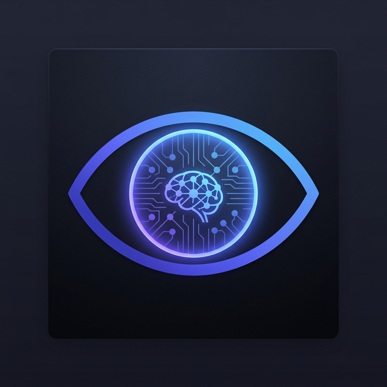

<div align="center">
  
  <h1>VISION AI Daemon (The Body)</h1>
  <p><strong>The Sensory and Motor Layer for Next-Gen AI — A Headless C++ gRPC Daemon</strong></p>
</div>

---

## 🎬 What is the VISION AI Daemon?

The **VISION AI Daemon** is the physical "Body" of the AI system. It is a highly optimized, headless **Windows C++ daemon** designed to act as the raw hardware interaction layer. It has **no intelligence of its own**. It exposes the operating system's sensory (audio, screen) and motor (keyboard, mouse, windows) functions over a **blazing fast gRPC protocol**.

By design, this daemon contains zero cognitive logic and zero UI. It exists purely to stream your microphone and screen to the "Brain" (Myraa AI Assistant), and perfectly execute the mouse and keyboard clicks that the Brain commands.

---

## 🧠 The Architecture (Body vs Brain)

This project works in tandem with the **Myraa AI Assistant** (The Brain). 

1. **VISION AI C++ (The Body):** Runs locally on your Windows machine. Uses almost no RAM. It captures your screen and microphone, and clicks your mouse.
2. **Myraa AI Assistant (The Brain):** A web-based UI that uses the Gemini Live API for intelligence. It connects to the Body via a Python gRPC Bridge.

**Why decouple them? (Low RAM Optimization)**
Running a local AI model (like LLaMA) takes 4GB - 8GB of RAM. By splitting the system, we offload the heavy thinking to the Cloud (Gemini) via Myraa. This means VISION AI C++ can run on extremely low-spec, low-RAM devices without crashing!

---

## ✨ Core Capabilities (Optimized for Speed)

- **Sensory Audio (Whisper.cpp):** Micro-sliced, chunked audio streaming over gRPC for zero-latency transcription.
- **Sensory Vision (DXGI + pHash):** Grabs screen frames only when pixels physically change (perceptual hashing) to save massive bandwidth.
- **Motor Control (Win32):** Injects flawless keystrokes and mouse clicks directly into the OS.

---

## 🚀 How to Run the Complete System

To bring the AI to life, you must run both the Body and the Brain simultaneously.

### Step 1: Build & Run VISION AI (The Body)
```bash
# 1. Generate the C++ gRPC bindings and configure the project
mkdir build && cd build
cmake -G "Visual Studio 17 2022" -A x64 -DCMAKE_EXPORT_COMPILE_COMMANDS=ON ..

# 2. Compile the highly-optimized Release build
cmake --build . --config Release --parallel

# 3. Launch the headless daemon (Listens on 127.0.0.1:53912)
./bin/Release/vision_daemon.exe
```

### Step 2: Run Myraa AI Assistant (The Brain)
Follow the instructions in the `myraa-ai-assistant` repository to launch the Python Synapse Bridge and the React Frontend.

---

## 🔮 The Future: 64GB RAM & Local LLMs

Right now, VISION AI C++ is perfectly optimized for low-RAM devices by acting as a "Dumb Pipe" to the cloud-powered Myraa Brain. 

**What if I upgrade to 64GB of RAM in the future?**
If you acquire a massive supercomputer or high-VRAM GPU, you can unleash local intelligence! 
Because of this decoupled architecture, you will **not** need to rewrite the C++ daemon. You can simply:
1. Stop using the cloud Gemini API in Myraa.
2. Boot up a massive local open-source LLM (like Llama 3 70B).
3. Point the Python Synapse Bridge directly to your local LLM instead of the internet.
4. The C++ Daemon will seamlessly accept commands from your local AI just as it did from the cloud! 

Alternatively, because the C++ project still contains the `models/` directory, a future update could re-integrate `llama.cpp` directly into the C++ daemon to run everything in a single offline executable if your hardware supports it.

---

## 📜 License
This project is licensed under the **MIT License**.
